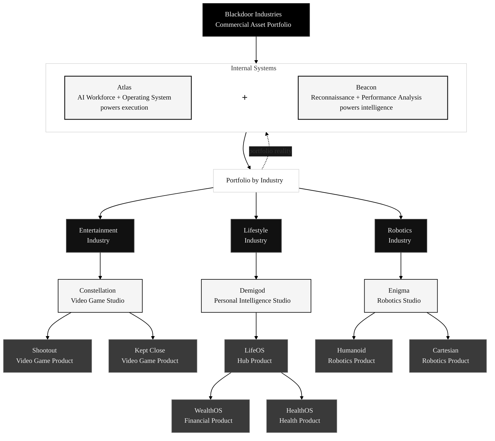

  

**A portfolio of commercial assets powered by an AI workforce.**

Entertainment &nbsp;·&nbsp; Lifestyle &nbsp;·&nbsp; Robotics

 

---

Blackdoor owns and operates ventures across entertainment, lifestyle, and robotics — each powered by **Atlas**, a shared AI workforce and operating system that coordinates agents, tools, workflows, playbooks, and integrations across the group.

*The mission is to prove that companies no longer need to be limited by the amount of human labor they can hire, manage, or afford.*

 

<table><tr>
<td align="center" valign="top" width="33%">
 
<b>Blackdoor</b>
  
Parent company and capital allocator. Sets strategy, governs structure, and deploys resources across the portfolio. Build to own. Structure to sell. Hold selectively.
  
</td>
<td align="center" valign="top" width="34%">
 
<b>Atlas</b>
  
Shared AI workforce and operating system. Agents, tools, playbooks, and integrations — powering execution across every venture in the portfolio.
  
</td>
<td align="center" valign="top" width="33%">
 
<b>Portfolio</b>
  
Constellation · Demigod · Enigma. Each venture runs on Atlas and owns its market independently.
  
</td>
</tr></table>

 

---

<h2>Organization</h2>

&nbsp;

&nbsp;

| Entity | Role | What it does |
|:---|:---|:---|
| **Blackdoor** | Commercial asset portfolio | Parent company. Owns group strategy, portfolio logic, capital allocation, and the doctrine that keeps the ventures coherent. Early-stage by revenue, serious by architecture. |
| **Atlas** | AI workforce + operating system | Coordinates agents, tools, workflows, and integrations across the group. Internal-first today; external commercialization possible if the system matures enough to sell without weakening the portfolio. |
| **Beacon** | Reconnaissance + performance analysis | Studies external opportunities, internal performance, and portfolio reality so the group can decide what to build, partner with, acquire, improve, or stop. |
| **Constellation** | Entertainment brand + video game studio | Uses Atlas for execution leverage. Produces interactive titles with focus on narrative, product taste, and reusable studio capability. |
| **Demigod** | Lifestyle brand + personal intelligence studio | LifeOS is the hub for personal systems, guidance, and domain-specific companion products. |
| **Enigma** | Robotics brand + studio | Robotics research and product lines inside the portfolio structure. Exploratory for now. |

---

## What We're Building

| Brand | Product | Status | Description |
|:---|:---|:---:|:---|
| **Constellation** | [Kept Close](https://github.com/Blackdoor-Industries/constellation-vngame-app) |  | Adult story collection for curious men. TypeScript, React 19, Three.js — working 3D scrapbook UI and functional content pipeline. |
| **Constellation** | Shootout |  | Competitive multiplayer action title. |
| **Demigod** | LifeOS |  | Personal systems hub. Aggregates life-domain data and surfaces recommendations through conversation. |
| **Demigod** | WealthOS |  | Standalone financial intelligence, natively integrated with LifeOS. |
| **Demigod** | HealthOS |  | Standalone health intelligence, same integration model. |

---

<h2>Development Lifecycle</h2>

&nbsp;

<strong>Define</strong> problems and opportunities &emsp; <strong>Explore</strong> research and analysis &emsp; <strong>Develop</strong> agents build on branches &emsp; <strong>Validate</strong> CI, review, feedback &emsp; <strong>Iterate</strong> learn and refine

&nbsp;

Every cycle begins with an open question — a problem worth solving or an opportunity worth testing. We explore before committing, letting research, data, and honest analysis shape what gets built. Agents handle more of the technical and operational heavy lifting over time; humans bring judgment, craft, taste, and final accountability. The goal is not automation theater. The goal is a repeatable operating model for building valuable companies with a small team.

---

## Founding Team

 

| Founder | Focus |
|:---|:---|
| [Ryder Wolf](https://github.com/ryderderder) | Strategy, systems architecture, AI workflows, documentation systems, product direction, UX |
| Pierre | Implementation, experimentation, deployment, and operational follow-through |

 

---

## Repositories

| Subsidiary | Repository | Purpose | Status |
|:---|:---|:---|:---:|
| Blackdoor | [`blackdoor-docs`](https://github.com/Blackdoor-Industries/blackdoor-docs) | Corporate strategy, governance, and operations |  |
| Atlas | [`atlas-docs`](https://github.com/Blackdoor-Industries/atlas-docs) | Agent infrastructure, playbooks, integration catalog |  |
| Constellation | [`constellation-docs`](https://github.com/Blackdoor-Industries/constellation-docs) | Studio strategy and business planning |  |
| Constellation | [`constellation-vngame-app`](https://github.com/Blackdoor-Industries/constellation-vngame-app) | Kept Close — adult story collection for curious men |  |
| Constellation | [`constellation-vngame-docs`](https://github.com/Blackdoor-Industries/constellation-vngame-docs) | Kept Close specs, design docs, and operations |  |
| Constellation | [`constellation-vngame-site`](https://github.com/Blackdoor-Industries/constellation-vngame-site) | Kept Close marketing website |  |
| Constellation | [`constellation-shootout-docs`](https://github.com/Blackdoor-Industries/constellation-shootout-docs) | Shootout — pre-production concepts |  |
| Demigod | [`demigod-docs`](https://github.com/Blackdoor-Industries/demigod-docs) | Life-intelligence strategy and business planning |  |
| Demigod | [`demigod-lifeos-app`](https://github.com/Blackdoor-Industries/demigod-lifeos-app) | LifeOS application code |  |
| Demigod | [`demigod-lifeos-docs`](https://github.com/Blackdoor-Industries/demigod-lifeos-docs) | LifeOS product specs and design |  |
| Demigod | [`demigod-lifeos-site`](https://github.com/Blackdoor-Industries/demigod-lifeos-site) | LifeOS marketing website |  |

&nbsp;

Status legend

&nbsp;

 Actively maintained, serving its purpose
&emsp;
 Active code or content work
&emsp;
 Planning and analysis phase
&emsp;
 Structure exists, awaiting active work

---

<strong>For AI Agents</strong>

&nbsp;

Every repository contains a `CLAUDE.md` at its root with agent-specific context, conventions, and constraints. Start there.

Org-wide standards:

- **Labels**: `type:` · `priority:` · `status:` · `subsidiary:` — 18 labels across 4 taxonomies, applied consistently
- **Branches**: `type/short-description` by default; direct `main` updates only by explicit founder instruction
- **CI**: Reusable workflows from `.github` — markdownlint on all docs repos, HTML validation, auto-assign on issues and PRs
- **PR workflow**: Branch → implement → CI passes → human review → merge

Agent infrastructure and playbooks are documented in [`atlas-docs`](https://github.com/Blackdoor-Industries/atlas-docs).

