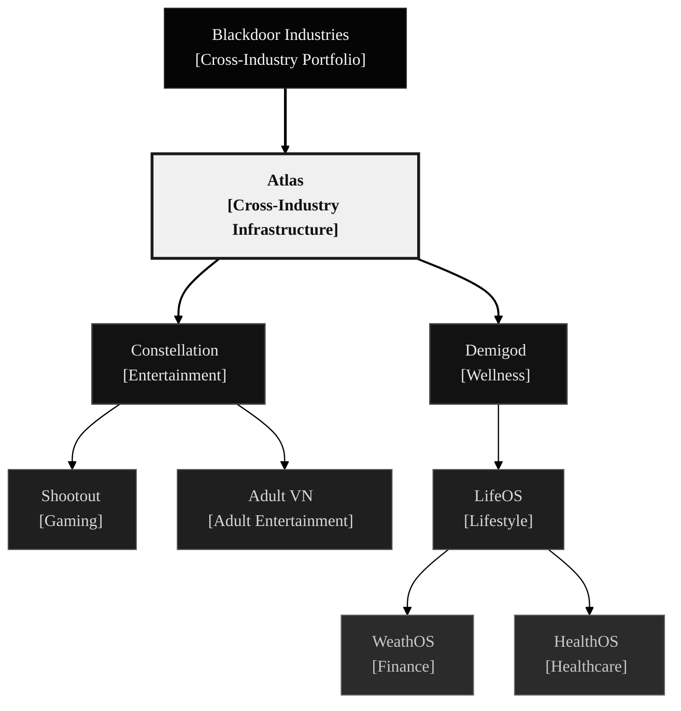

<em>Pre-revenue&nbsp;&middot;&nbsp;Self-funded&nbsp;&middot;&nbsp;2 founders&nbsp;&middot;&nbsp;AI agents</em>

 
 
 

 

<h3 align="left">We provide the AI workforce 
that runs your autonomous business.</h3>

We provide the executive AI teams — CEOs, CTOs, CMOs — 
cascading down to project managers, researchers, 
and specialized field agents, that work together to eliminate 
the manual overhead of starting or running your business. 
 
Our agents execute on your specific vision, values, standards, and goals 
with minimal human friction, allowing you to turn brand new ventures 
into fully automated businesses or migrate existing manual operations 
to our autonomous platform.

<h4 align="left">We empower solo founders, small businesses, 
and enterprises to achieve more than humanly possible.</h4>

<em>We are not just creating technology; 
we are changing how the world works.</em>

<h2>Organization</h2>

&nbsp;

&nbsp;

**Blackdoor Industries** — The holding company. Owns and governs the portfolio — strategy, capital, direction. All operational activity runs through the subsidiaries. We're bringing autonomous AI workforces to every industry: Technology, Entertainment, Wellness, Finance, Healthcare, Legal, Manufacturing, Logistics, and beyond.

**Atlas** — Blackdoor's core IP and the AI Workforce Platform. Atlas is what Blackdoor sells: executive AI teams — CEOs, CTOs, CMOs — cascading down to project managers, researchers, and field agents that run complete business operations. Every other subsidiary is built on Atlas. The agent conventions, CI workflows, playbooks, and protocols that codify how autonomous teams operate live here.

**Constellation** — A game studio running on the Atlas workforce. Produces titles across genres with AI agents handling production pipelines.

- *Shootout* — Competitive multiplayer action title. Pre-production.
- *Adult Visual Novel* — Explicit content title. TypeScript, React 19, Three.js. Working codebase, 3D scrapbook UI, functional content pipeline. Not yet deployed.

**Demigod** — An AI self-help ecosystem. LifeOS serves as a personal intelligence app — aggregating life data and surfacing actionable guidance through conversation. Companion apps integrate natively, segmenting specific domains and feeding enriched data back into the core.

- *LifeOS* — Personal intelligence hub. Aggregates data across life domains and surfaces recommendations through conversation.
  - *WealthOS* — Standalone financial intelligence app. Natively integrates with LifeOS, segments financial tools, and returns insights to the hub.
  - *HealthOS* — Standalone health intelligence app. Same integration model — feeds enriched health data back to LifeOS.

Constellation ships first. Demigod follows. Atlas compounds alongside both.

---

<h2>Development Lifecycle</h2>

&nbsp;

<strong>Define</strong> problems and opportunities &emsp; <strong>Explore</strong> research and analysis &emsp; <strong>Develop</strong> agents build on branches &emsp; <strong>Validate</strong> CI, review, feedback &emsp; <strong>Iterate</strong> learn and refine

&nbsp;

Every cycle begins with an open question — a problem worth solving or an opportunity worth seizing. We explore the full universe of possibilities before committing to a path, letting research, data, and honest analysis shape what gets built. Agents execute the technical heavy lifting across development and validation; humans bring judgment, craft, and taste. The goal is never "done" — it's exceptional. We blend the precision of modern AI infrastructure with the ambition of builders who believe technology can transform every industry on earth.

---

## Team

 

<table>
<tr>
<td align="center">
<a href="https://github.com/ryderderder"> <strong>Ryder Wolf</strong></a> 
Founder 
Research · Strategy · Systems · UX
</td>
<td width="80"></td>
<td align="center">
<a href="https://github.com/PIERRE_USERNAME"> <strong>Pierre</strong></a> 
Co-founder 
Implementation · Experimentation · Deployment
</td>
</tr>
</table>

 

---

<h2>Repositories</h2>

&nbsp;

| Subsidiary | Repository | Purpose | Status |
|:---|:---|:---|:---:|
| Blackdoor | [`blackdoor-docs`](https://github.com/Blackdoor-Industries/blackdoor-docs) | Corporate strategy, governance, and operations |  |
| Atlas | [`atlas-docs`](https://github.com/Blackdoor-Industries/atlas-docs) | Agent infrastructure, playbooks, integration catalog |  |
| Constellation | [`constellation-docs`](https://github.com/Blackdoor-Industries/constellation-docs) | Studio strategy and business planning |  |
| Constellation | [`constellation-vngame-app`](https://github.com/Blackdoor-Industries/constellation-vngame-app) | VN Game — TypeScript, React 19, Three.js |  |
| Constellation | [`constellation-vngame-docs`](https://github.com/Blackdoor-Industries/constellation-vngame-docs) | VN Game specs, design docs, and operations |  |
| Constellation | [`constellation-vngame-site`](https://github.com/Blackdoor-Industries/constellation-vngame-site) | VN Game marketing website |  |
| Constellation | [`constellation-shootout-docs`](https://github.com/Blackdoor-Industries/constellation-shootout-docs) | Shootout — pre-production concepts |  |
| Demigod | [`demigod-docs`](https://github.com/Blackdoor-Industries/demigod-docs) | Ecosystem strategy and business planning |  |
| Demigod | [`demigod-lifeos-app`](https://github.com/Blackdoor-Industries/demigod-lifeos-app) | LifeOS application code |  |
| Demigod | [`demigod-lifeos-docs`](https://github.com/Blackdoor-Industries/demigod-lifeos-docs) | LifeOS product specs and design |  |
| Demigod | [`demigod-lifeos-site`](https://github.com/Blackdoor-Industries/demigod-lifeos-site) | LifeOS marketing website |  |

&nbsp;

Status legend

&nbsp;

 Actively maintained, serving its purpose
&emsp;
 Active code or content work
&emsp;
 Planning and analysis phase
&emsp;
 Structure exists, awaiting active work

---

<strong>For AI Agents</strong>

&nbsp;

Every repository contains a `CLAUDE.md` at its root with agent-specific context, conventions, and constraints. Start there.

Org-wide standards:

- **Labels**: `type:` · `priority:` · `status:` · `subsidiary:` — 18 labels across 4 taxonomies, applied consistently
- **Branches**: `type/short-description` — all work on feature branches, no direct pushes to `main`
- **CI**: Reusable workflows from `.github` — markdownlint on all docs repos, HTML validation, auto-assign on issues and PRs
- **PR workflow**: Branch → implement → CI passes → human review → merge

Agent infrastructure and playbooks are documented in [`atlas-docs`](https://github.com/Blackdoor-Industries/atlas-docs).

