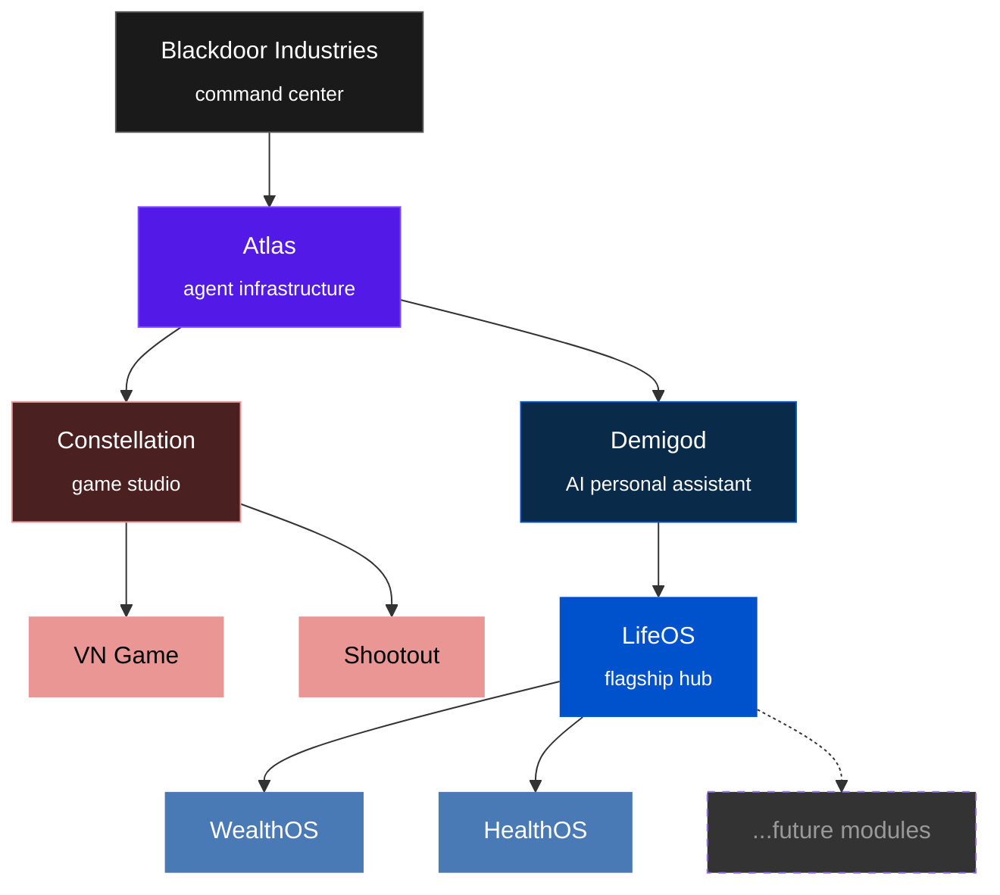
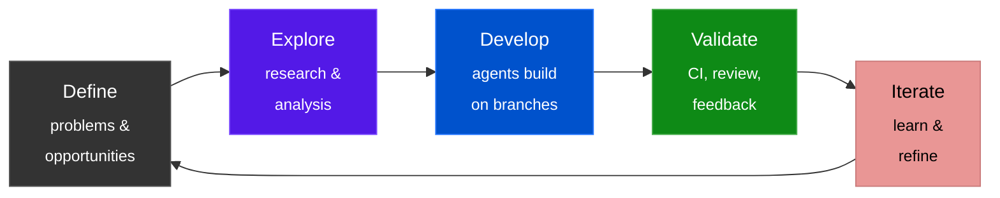

# Blackdoor Industries

**We provide the AI workforce that runs your autonomous business.**

We empower solo founders, small businesses, and enterprises to achieve more
than humanly possible. Our agents execute on your specific vision, values,
standards, and goals — turning new ventures into fully automated businesses
or migrating existing operations to our autonomous platform.

We are not just creating technology. We are changing how the world works.

---

Pre-revenue · Self-funded · Two humans and a fleet of AI agents

## Organization

## Subsidiaries

**Atlas** — Agent infrastructure powering all of Blackdoor.
Not a product — the backbone. Encompasses the toolchain, conventions, agent protocols, and operational playbooks that enable AI agents to build and operate everything across Blackdoor. Currently operational as documented conventions and configurations: CLAUDE.md files, CI workflows, standardized labels, reusable workflows.

**Constellation** — Game studio producing narrative-driven interactive experiences.
Targets underserved markets at high quality and scale using AI-generated content. A two-person team with AI agents competing with studios that have dedicated creative teams. The VN Game (TypeScript, React 19, Three.js) has a working codebase with a 3D scrapbook UI and content pipeline. No deployment yet.

**Demigod** — AI-powered personal assistant ecosystem.
LifeOS is the flagship hub — a single app that aggregates your life data and provides AI-powered recommendations through a conversational interface. WealthOS, HealthOS, and future modules are standalone apps that plug into LifeOS as an ecosystem. Currently in planning phase. Development starts after Constellation ships its first title.

*Gaming, personal AI, and agent infrastructure — three industries, one methodology. Constellation ships first. Demigod follows. Atlas matures alongside both.*

## Repositories

<table>
<thead>
<tr>
<th>Subsidiary</th>
<th>Repository</th>
<th>Purpose</th>
<th>Status</th>
</tr>
</thead>
<tbody>
<tr>
<td>Blackdoor</td>
<td><a href="https://github.com/Blackdoor-Industries/blackdoor-docs"><code>blackdoor-docs</code></a></td>
<td>Strategy, research, operations — the command center</td>
<td></td>
</tr>
<tr>
<td>Atlas</td>
<td><a href="https://github.com/Blackdoor-Industries/atlas-docs"><code>atlas-docs</code></a></td>
<td>Architecture, playbooks, integration catalog</td>
<td></td>
</tr>
<tr>
<td>Constellation</td>
<td><a href="https://github.com/Blackdoor-Industries/constellation-docs"><code>constellation-docs</code></a></td>
<td>Studio strategy and business planning</td>
<td></td>
</tr>
<tr>
<td>Constellation</td>
<td><a href="https://github.com/Blackdoor-Industries/constellation-vngame-app"><code>constellation-vngame-app</code></a></td>
<td>Visual novel — TypeScript, React, Three.js</td>
<td></td>
</tr>
<tr>
<td>Constellation</td>
<td><a href="https://github.com/Blackdoor-Industries/constellation-vngame-docs"><code>constellation-vngame-docs</code></a></td>
<td>VN game specs, design docs, operations</td>
<td></td>
</tr>
<tr>
<td>Constellation</td>
<td><a href="https://github.com/Blackdoor-Industries/constellation-vngame-site"><code>constellation-vngame-site</code></a></td>
<td>VN game marketing website</td>
<td></td>
</tr>
<tr>
<td>Constellation</td>
<td><a href="https://github.com/Blackdoor-Industries/constellation-shootout-docs"><code>constellation-shootout-docs</code></a></td>
<td>Shootout — pre-production concepts</td>
<td></td>
</tr>
<tr>
<td>Demigod</td>
<td><a href="https://github.com/Blackdoor-Industries/demigod-docs"><code>demigod-docs</code></a></td>
<td>Ecosystem strategy and business planning</td>
<td></td>
</tr>
<tr>
<td>Demigod</td>
<td><a href="https://github.com/Blackdoor-Industries/demigod-lifeos-app"><code>demigod-lifeos-app</code></a></td>
<td>LifeOS application code</td>
<td></td>
</tr>
<tr>
<td>Demigod</td>
<td><a href="https://github.com/Blackdoor-Industries/demigod-lifeos-docs"><code>demigod-lifeos-docs</code></a></td>
<td>LifeOS product specs and design</td>
<td></td>
</tr>
<tr>
<td>Demigod</td>
<td><a href="https://github.com/Blackdoor-Industries/demigod-lifeos-site"><code>demigod-lifeos-site</code></a></td>
<td>LifeOS marketing website</td>
<td></td>
</tr>
</tbody>
</table>

>  Actively maintained, serving its purpose&emsp;
>  Active code or content work&emsp;
>  Planning and analysis phase&emsp;
>  Structure exists, awaiting active work

## How We Build

Every repo has a `CLAUDE.md` with agent context. Standardized labels, branch conventions, CI, and PR workflows apply org-wide.

## Team

**Ryder Wolf** — Founder. Process, performance, and quality systems. Research, strategy, systems architecture, UI/UX design.

**Pierre** — Co-founder. Implementation, experimentation, deployment, iteration.
