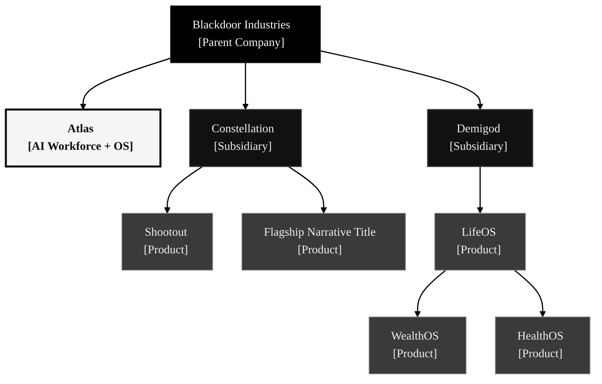
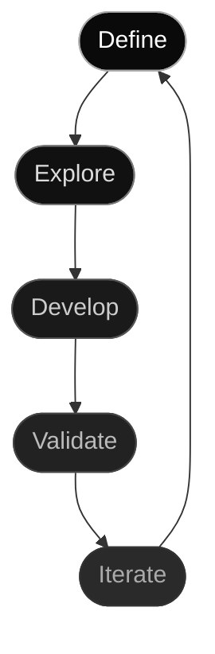

<em>Early-stage&nbsp;&middot;&nbsp;Self-funded&nbsp;&middot;&nbsp;2 founders&nbsp;&middot;&nbsp;AI workforce</em>

 
 
 

 

<h3 align="left">Building a portfolio of profitable, 
agent-operated companies.</h3>

Blackdoor is an early-stage company-building system: 
parent doctrine, focused venture brands, 
and Atlas — the internal AI workforce and operating system 
designed to help a small team create more than it could run manually. 
 
The goal is not to look busy. 
The goal is to build real subsidiaries that can become profitable, 
agent-operated, independently understandable, 
and valuable enough to hold, partner, or sell.

<h4 align="left">Atlas is what Blackdoor uses to build. 
The subsidiaries are where the market-facing businesses live.</h4>

<em>We are not just creating technology; 
we are designing the operating model for what comes next.</em>

<h2>Organization</h2>

&nbsp;

&nbsp;

**Blackdoor Industries** — The parent company and company-building system. Owns group strategy, portfolio logic, capital allocation, and the doctrine that keeps the subsidiaries coherent. Blackdoor is early-stage by revenue, but serious by architecture: the group is being built around profitable, autonomously operated companies rather than disconnected experiments.

**Atlas** — Blackdoor's AI workforce and operating system. Atlas coordinates agents, tools, workflows, playbooks, and integrations across the group. It is internal-first today: what Blackdoor uses to build and operate. External commercialization may come later if the system matures enough to sell without weakening the portfolio.

**Constellation** — An entertainment venture brand using Atlas for leverage behind the scenes. Produces interactive titles with a focus on narrative, product taste, and reusable studio capability.

- *Shootout* — Competitive multiplayer action title. Pre-production.
- *Flagship narrative title* — Interactive narrative product. TypeScript, React 19, Three.js. Working codebase, 3D scrapbook UI, functional content pipeline. Not yet deployed.

**Demigod** — A life-intelligence venture. LifeOS is the hub product for personal systems, guidance, and future domain-specific companion products.

- *LifeOS* — Ecosystem hub. Aggregates data across life domains and surfaces recommendations through conversation.
  - *WealthOS* — Standalone financial intelligence app. Natively integrates with LifeOS, segments financial tools, and returns insights to the hub.
  - *HealthOS* — Standalone health intelligence app. Same integration model — feeds enriched health data back to LifeOS.

Constellation ships first. Demigod follows. Atlas compounds alongside both.

---

<h2>Development Lifecycle</h2>

&nbsp;

<strong>Define</strong> problems and opportunities &emsp; <strong>Explore</strong> research and analysis &emsp; <strong>Develop</strong> agents build on branches &emsp; <strong>Validate</strong> CI, review, feedback &emsp; <strong>Iterate</strong> learn and refine

&nbsp;

Every cycle begins with an open question — a problem worth solving or an opportunity worth testing. We explore before committing, letting research, data, and honest analysis shape what gets built. Agents handle more of the technical and operational heavy lifting over time; humans bring judgment, craft, taste, and final accountability. The goal is not automation theater. The goal is a repeatable operating model for building valuable companies with a small team.

---

## Founding Team

 

| Founder | Focus |
|:---|:---|
| [Ryder Wolf](https://github.com/ryderderder) | Strategy, systems architecture, AI workflows, documentation systems, product direction, UX |
| Pierre | Implementation, experimentation, deployment, and operational follow-through |

 

---

<h2>Repositories</h2>

&nbsp;

| Subsidiary | Repository | Purpose | Status |
|:---|:---|:---|:---:|
| Blackdoor | [`blackdoor-docs`](https://github.com/Blackdoor-Industries/blackdoor-docs) | Corporate strategy, governance, and operations |  |
| Atlas | [`atlas-docs`](https://github.com/Blackdoor-Industries/atlas-docs) | Agent infrastructure, playbooks, integration catalog |  |
| Constellation | [`constellation-docs`](https://github.com/Blackdoor-Industries/constellation-docs) | Studio strategy and business planning |  |
| Constellation | [`constellation-vngame-app`](https://github.com/Blackdoor-Industries/constellation-vngame-app) | Flagship narrative title — TypeScript, React 19, Three.js |  |
| Constellation | [`constellation-vngame-docs`](https://github.com/Blackdoor-Industries/constellation-vngame-docs) | Flagship narrative title specs, design docs, and operations |  |
| Constellation | [`constellation-vngame-site`](https://github.com/Blackdoor-Industries/constellation-vngame-site) | Flagship narrative title marketing website |  |
| Constellation | [`constellation-shootout-docs`](https://github.com/Blackdoor-Industries/constellation-shootout-docs) | Shootout — pre-production concepts |  |
| Demigod | [`demigod-docs`](https://github.com/Blackdoor-Industries/demigod-docs) | Life-intelligence strategy and business planning |  |
| Demigod | [`demigod-lifeos-app`](https://github.com/Blackdoor-Industries/demigod-lifeos-app) | LifeOS application code |  |
| Demigod | [`demigod-lifeos-docs`](https://github.com/Blackdoor-Industries/demigod-lifeos-docs) | LifeOS product specs and design |  |
| Demigod | [`demigod-lifeos-site`](https://github.com/Blackdoor-Industries/demigod-lifeos-site) | LifeOS marketing website |  |

&nbsp;

Status legend

&nbsp;

 Actively maintained, serving its purpose
&emsp;
 Active code or content work
&emsp;
 Planning and analysis phase
&emsp;
 Structure exists, awaiting active work

---

<strong>For AI Agents</strong>

&nbsp;

Every repository contains a `CLAUDE.md` at its root with agent-specific context, conventions, and constraints. Start there.

Org-wide standards:

- **Labels**: `type:` · `priority:` · `status:` · `subsidiary:` — 18 labels across 4 taxonomies, applied consistently
- **Branches**: `type/short-description` by default; direct `main` updates only by explicit founder instruction
- **CI**: Reusable workflows from `.github` — markdownlint on all docs repos, HTML validation, auto-assign on issues and PRs
- **PR workflow**: Branch → implement → CI passes → human review → merge

Agent infrastructure and playbooks are documented in [`atlas-docs`](https://github.com/Blackdoor-Industries/atlas-docs).

