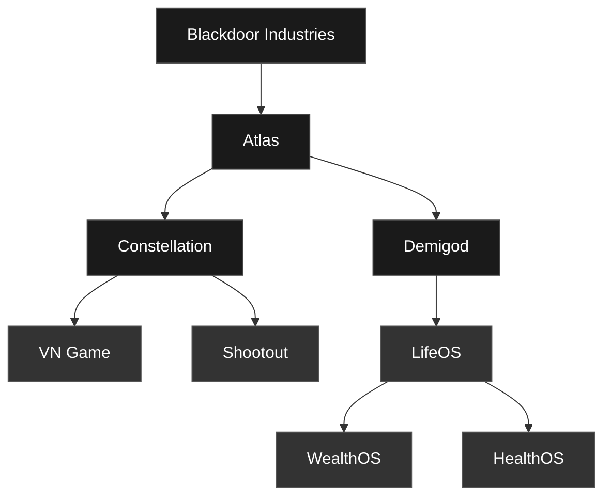
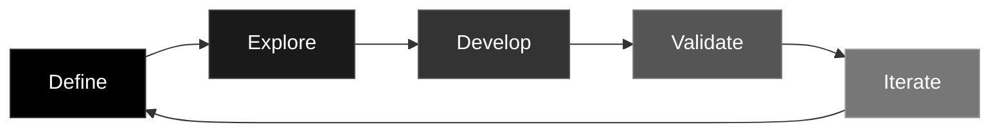

 

<h3 align="left">We provide the AI workforce 
that runs your autonomous business.</h3>

We provide the executive AI teams — CEOs, CTOs, CMOs — 
cascading down to project managers, researchers, 
and specialized field agents, that work together to eliminate 
the manual overhead of starting or running your business. 
 
Our agents execute on your specific vision, values, standards, and goals 
with minimal human friction, allowing you to turn brand new ventures 
into fully automated businesses or migrate existing manual operations 
to our autonomous platform.

We empower solo founders, small businesses, 
and enterprises to achieve <strong>more than humanly possible.</strong> 
 
We are not just creating technology; 
we are changing how the world works.

<h1>Organization</h1>

&nbsp;

<strong>Atlas</strong> · Agent Infrastructure &emsp; <strong>Constellation</strong> · Game Studio &emsp; <strong>Demigod</strong> · AI Assistant

&nbsp;

**Atlas** — The agent infrastructure that powers everything else at Blackdoor. Not a product for sale — the operational backbone. CLAUDE.md conventions, CI workflows, standardized protocols, and playbooks that let AI agents build and ship across every repo. Atlas matures as the product lines do.

**Constellation** — A game studio that pairs two humans with AI agents to produce narrative-driven interactive experiences. First title is a visual novel built with TypeScript, React 19, and Three.js — working codebase, 3D scrapbook UI, functional content pipeline. Not yet deployed.

**Demigod** — An AI personal assistant ecosystem anchored by LifeOS, a hub that aggregates life data and surfaces recommendations through conversation. WealthOS, HealthOS, and future modules plug in around it. Currently in planning. Development begins after Constellation ships.

Constellation ships first. Demigod follows. Atlas compounds alongside both.

---

## How We Build

<strong>Define</strong> problems and opportunities &emsp; <strong>Explore</strong> research and analysis &emsp; <strong>Develop</strong> agents build on branches &emsp; <strong>Validate</strong> CI, review, feedback &emsp; <strong>Iterate</strong> learn and refine

&nbsp;

Agents don't just assist here — they develop, review, and ship. Every repo has a `CLAUDE.md` with agent context, and standardized labels, branch conventions, CI, and PR workflows apply org-wide.

---

## Team

**Ryder Wolf** — Founder. Comes from enterprise process, performance, and quality systems. At Blackdoor, he owns research, strategy, systems architecture, and UI/UX. He designed the agent-first methodology that Atlas codifies.

**Pierre** — Co-founder. Owns implementation, experimentation, and deployment. Responsible for turning architecture into working software and iterating on what ships.

---

## Repositories

<strong>Blackdoor</strong> — Command Center

&nbsp;

| Repository | Purpose | Status |
|---|---|---|
| [`blackdoor-docs`](https://github.com/Blackdoor-Industries/blackdoor-docs) | Strategy, research, operations |  |

<strong>Atlas</strong> — Agent Infrastructure

&nbsp;

| Repository | Purpose | Status |
|---|---|---|
| [`atlas-docs`](https://github.com/Blackdoor-Industries/atlas-docs) | Architecture, playbooks, integration catalog |  |

<strong>Constellation</strong> — Game Studio

&nbsp;

| Repository | Purpose | Status |
|---|---|---|
| [`constellation-docs`](https://github.com/Blackdoor-Industries/constellation-docs) | Studio strategy and business planning |  |
| [`constellation-vngame-app`](https://github.com/Blackdoor-Industries/constellation-vngame-app) | Visual novel — TypeScript, React, Three.js |  |
| [`constellation-vngame-docs`](https://github.com/Blackdoor-Industries/constellation-vngame-docs) | Game specs, design docs, operations |  |
| [`constellation-vngame-site`](https://github.com/Blackdoor-Industries/constellation-vngame-site) | Marketing website |  |
| [`constellation-shootout-docs`](https://github.com/Blackdoor-Industries/constellation-shootout-docs) | Pre-production concepts |  |

<strong>Demigod</strong> — AI Assistant Ecosystem

&nbsp;

| Repository | Purpose | Status |
|---|---|---|
| [`demigod-docs`](https://github.com/Blackdoor-Industries/demigod-docs) | Ecosystem strategy and business planning |  |
| [`demigod-lifeos-app`](https://github.com/Blackdoor-Industries/demigod-lifeos-app) | LifeOS application code |  |
| [`demigod-lifeos-docs`](https://github.com/Blackdoor-Industries/demigod-lifeos-docs) | LifeOS product specs and design |  |
| [`demigod-lifeos-site`](https://github.com/Blackdoor-Industries/demigod-lifeos-site) | Marketing website |  |

Status legend

&nbsp;

 Actively maintained, serving its purpose
&emsp;
 Active code or content work
&emsp;
 Planning and analysis phase
&emsp;
 Structure exists, awaiting active work

---

<strong>For AI Agents</strong>

&nbsp;

Every repository has a `CLAUDE.md` at its root with agent-specific context, conventions, and constraints. Start there.

Org-wide standards:
- **Labels**: `type:`, `priority:`, `status:`, `subsidiary:` taxonomy (18 labels per repo)
- **Branches**: Feature branches, PRs for all work, human approval required
- **CI**: Reusable workflows from `.github` repo, markdownlint on all docs repos
- **PR workflow**: Branch → implement → CI passes → human review → merge

Agent infrastructure is documented in [`atlas-docs`](https://github.com/Blackdoor-Industries/atlas-docs).

---

Pre-revenue · Self-funded · Proving the model by building with it

