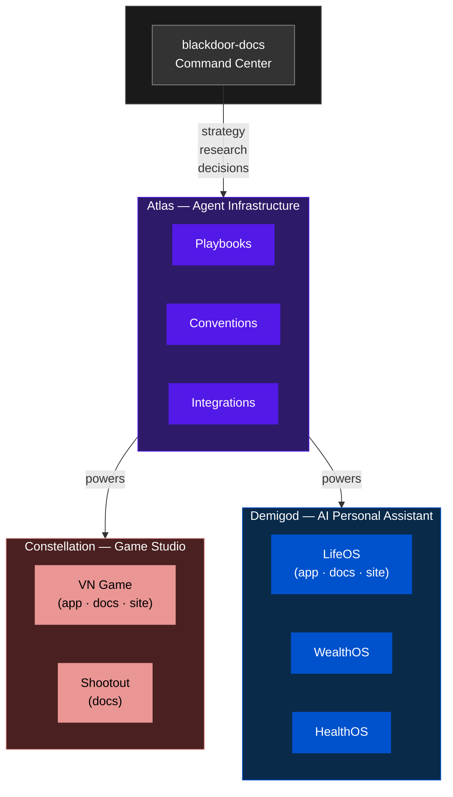
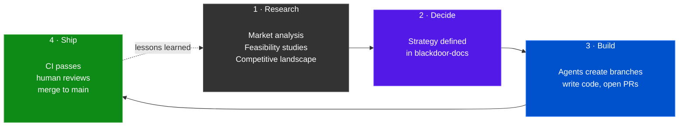

# Blackdoor Industries

**We provide the AI workforce that runs your autonomous business.**

We empower solo founders, small businesses, and enterprises to achieve more than humanly possible. Our agents execute on your specific vision, values, standards, and goals — turning new ventures into fully automated businesses or migrating existing operations to our autonomous platform.

We are not just creating technology. We are changing how the world works.

---

---

## Repositories

### Blackdoor Industries (Parent)

| Repository | Purpose | Status |
|:-----------|:--------|:------:|
| [`blackdoor-docs`](https://github.com/Blackdoor-Industries/blackdoor-docs) | Strategy, research, operations — the command center | :green_circle: Active |

### Atlas — Agent Infrastructure

| Repository | Purpose | Status |
|:-----------|:--------|:------:|
| [`atlas-docs`](https://github.com/Blackdoor-Industries/atlas-docs) | Architecture, playbooks, integration catalog | :green_circle: Active |

### Constellation — Game Studio

| Repository | Purpose | Status |
|:-----------|:--------|:------:|
| [`constellation-docs`](https://github.com/Blackdoor-Industries/constellation-docs) | Studio strategy and business planning | :green_circle: Active |
| [`constellation-vngame-app`](https://github.com/Blackdoor-Industries/constellation-vngame-app) | Visual novel game — TypeScript, React, Three.js | :green_circle: Active |
| [`constellation-vngame-docs`](https://github.com/Blackdoor-Industries/constellation-vngame-docs) | VN game specs, design docs, operations | :green_circle: Active |
| [`constellation-vngame-site`](https://github.com/Blackdoor-Industries/constellation-vngame-site) | VN game marketing website | :yellow_circle: Planned |
| [`constellation-shootout-docs`](https://github.com/Blackdoor-Industries/constellation-shootout-docs) | Shootout — pre-production concepts | :yellow_circle: Planned |

### Demigod — AI Personal Assistant

| Repository | Purpose | Status |
|:-----------|:--------|:------:|
| [`demigod-docs`](https://github.com/Blackdoor-Industries/demigod-docs) | Ecosystem strategy and business planning | :green_circle: Active |
| [`demigod-lifeos-app`](https://github.com/Blackdoor-Industries/demigod-lifeos-app) | LifeOS — application code | :yellow_circle: Planned |
| [`demigod-lifeos-docs`](https://github.com/Blackdoor-Industries/demigod-lifeos-docs) | LifeOS — product specs and design | :green_circle: Active |
| [`demigod-lifeos-site`](https://github.com/Blackdoor-Industries/demigod-lifeos-site) | LifeOS — marketing website | :yellow_circle: Planned |

> :green_circle: **Active** — under development&emsp;&emsp;:yellow_circle: **Planned** — scaffolded, awaiting active work

---

## How It Works

Every repo has a `CLAUDE.md` with agent context. Standardized labels, branch conventions, CI, and PR workflows apply org-wide. Details in [`atlas-docs/playbooks`](https://github.com/Blackdoor-Industries/atlas-docs/tree/main/playbooks).
